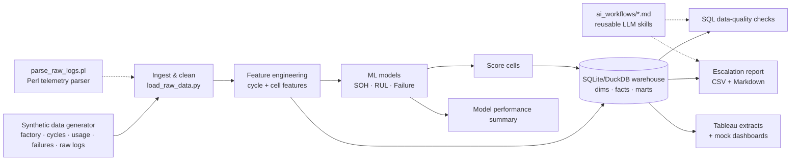

# 🔋 Battery Failure Intelligence Platform

**An end-to-end battery engineering analytics platform** that ingests lithium-ion
cycling, impedance, synthetic factory, usage, and failure-event data; builds a SQL
data warehouse; trains ML models for **state-of-health (SOH)**, **remaining useful
life (RUL)**, and **failure-risk prediction**; and generates **automated engineering
escalation reports** and **Tableau-ready dashboard outputs**.

> ⚠️ **Data disclaimer:** this project uses **100% synthetic, physically-motivated
> battery data** generated locally. It does **not** use any Apple confidential data
> and does **not** imply access to any Apple internal system. It is a personal
> portfolio project built to demonstrate relevant engineering-analytics skills.

---

## Why this project exists

Battery reliability teams live and die by three questions, every single day:

1. **How healthy is each cell?** (state of health)
2. **How much life is left?** (remaining useful life)
3. **Which cells / lots / stations need to be escalated *now*?** (failure risk)

This platform answers all three on a reproducible, automated cadence — from raw
telemetry all the way to a ranked escalation queue with a likely root cause and a
recommended engineering follow-up for every flagged cell. It is deliberately built
as an **engineering analytics system**, not a one-off Kaggle notebook: it has a
landing zone, a star-schema warehouse, data-quality gates, modular pipeline steps,
tests, CI, and reusable AI workflows.

---

## Role Fit: Apple Battery Engineering Data Scientist Contractor

This project was built to map directly onto the JD for the **Data Scientist
Contractor – Battery Engineering Analytics** role.

| JD requirement | Where it lives in this repo |
| --- | --- |
| **Python ML functions** | `src/models/` — SOH regression, RUL regression, failure classification (scikit-learn, optional LightGBM/XGBoost) |
| **GitHub software traceability** | Modular `src/` package, `pyproject.toml`, tests, GitHub Actions CI (`.github/workflows/ci.yml`) |
| **SQL database & data warehousing / modeling** | `sql/` star schema + marts, built into SQLite/DuckDB by `src/warehouse/` |
| **Factory, user & failure data analysis** | `factory`, `usage`, `failure_events` tables + `mart_factory_quality`, station/lot anomaly analysis |
| **Urgent escalation reporting** | `src/reporting/generate_escalation_report.py` → `reports/escalation_report_sample.csv` + `high_risk_cells_summary.md` |
| **Tableau-ready reporting** | `dashboards/tableau_extracts/*.csv` + `dashboards/tableau_dashboard_blueprint.md` (4 dashboard pages) |
| **Unix / Bash / Perl environment** | `scripts/parse_raw_logs.pl`, `validate_files.sh`, `run_daily_pipeline.sh`, `sql_export.sh` |
| **Statistics & value-added analysis** | Feature engineering, grouped validation, correlation/anomaly analysis, model metrics |
| **Reporting automation** | One-command daily pipeline regenerates data → warehouse → models → reports → extracts |
| **AI-powered reusable workflows** | `ai_workflows/` — 4 reusable LLM skills for anomaly triage, NL→SQL, model debugging, escalation writing |
| **Battery engineering domain** | Capacity fade + knee, impedance growth, thermal/fast-charge stress, EOL at 80% SOH, lot/station quality |

---

## Architecture



The whole thing is orchestrated by **`scripts/run_daily_pipeline.sh`** (11 steps),
runs locally from a fresh clone with no database server, and is exercised in CI on
every push.

---

## Data model

Five linked source tables, all synthetic:

| Table | Grain | Key fields |
| --- | --- | --- |
| **factory** | one row / cell | `cell_id, batch_id, lot_id, station_id, test_temperature, charge/discharge_current, manufacturing_date, test_date, equipment_id` |
| **cycles** | cell × cycle | `cycle_index, voltage_*, current_mean, temperature_mean/max, discharge/charge_capacity_ah, internal_resistance_mohm, energy_wh, timestamp` |
| **usage** | one row / cell | `avg_depth_of_discharge, fast_charge_ratio, avg_daily_cycles, high/low_temp_exposure_hours, usage_profile` |
| **failure_events** | one row / cell | `event_date, event_type, capacity_drop/impedance_spike/thermal_anomaly events, early_degradation_flag, escalation_required, failure_severity` |
| **model_predictions** | one row / cell | `prediction_date, predicted_soh, predicted_remaining_cycles, failure_probability, risk_tier, top_risk_driver` |

### Warehouse (star schema)

```
dim_cell · dim_lot · dim_station · dim_test_condition
fact_cycle_measurements · fact_usage_profile · fact_failure_events · fact_model_predictions
mart_cell_health_summary · mart_factory_quality · mart_escalation_queue
```

DDL: [`sql/create_schema.sql`](sql/create_schema.sql) · marts:
[`sql/build_marts.sql`](sql/build_marts.sql) · QC:
[`sql/quality_checks.sql`](sql/quality_checks.sql) · ad-hoc engineering questions:
[`sql/example_ad_hoc_queries.sql`](sql/example_ad_hoc_queries.sql).

---

## ML modeling overview

Models are trained with **leakage-aware, cell-grouped validation** (all cycles of a
given cell stay on one side of the split). Feature contracts are explicit in
[`src/models/_common.py`](src/models/_common.py).

| Model | Target | Algorithms | Headline metrics* |
| --- | --- | --- | --- |
| **State of Health** | `soh_current = discharge_cap / initial_cap` | Linear baseline vs RandomForest / GradientBoosting | **R² 0.955 · MAE 0.010 · RMSE 0.015** |
| **Remaining Useful Life** | cycles until SOH < 80% | RandomForest vs GradientBoosting | **MAE 46 cycles · RMSE 69 · R² 0.928** |
| **Failure Risk** | `escalation_required` | Logistic baseline vs RandomForest | **F1 0.857 · ROC-AUC 0.993 · Recall 1.00** |

*From the latest 120-cell synthetic run; regenerated into
[`reports/model_performance_summary.md`](reports/model_performance_summary.md) every
pipeline run. Numbers vary slightly with data scale / quick mode.*

**Engineered features** include `capacity_fade_rate`, `resistance_growth_rate`,
`rolling_capacity_mean_10`, `rolling_temperature_max_10`, `rolling_resistance_mean_10`,
`soh_delta_last_20_cycles`, `cycle_count`, `fast_charge_ratio`,
`high_temp_exposure_hours`, `batch_failure_rate`, `station_anomaly_rate`.

**Explainability:** uses **SHAP** if installed, otherwise falls back to
**permutation importance**; the leading degradation drivers feed the
`top_risk_driver` column of every escalation row.

---

## Reporting automation

`scripts/run_daily_pipeline.sh` runs the full job end-to-end:

1. Generate / ingest data → 2. Parse raw logs (Perl) + validate files →
3. Build warehouse → 4. SQL quality checks → 5. Build features →
6. Train / reuse models → 7. Score cells → 8. Write predictions to warehouse →
9. Escalation report → 10. Tableau extracts → 11. Model performance summary.

Outputs are written to `data/processed/`, `reports/`, and `dashboards/`.

---

## Tableau dashboard overview

Tableau Desktop is **not required**. The pipeline exports flat, BI-ready CSV
extracts to `dashboards/tableau_extracts/` and renders static PNG mockups to
`dashboards/screenshots_or_mockups/`. The full design (charts + fields per page)
is in [`dashboards/tableau_dashboard_blueprint.md`](dashboards/tableau_dashboard_blueprint.md):

1. **Executive Battery Health Overview** — fleet risk tiers, SOH vs remaining cycles.
2. **Factory Lot Quality** — escalation/anomaly rates by lot × station.
3. **Engineering Root Cause Analysis** — drivers by usage profile.
4. **Escalation Queue** — ranked cells needing action today.

---

## AI workflow overview

Four reusable, LLM-powered skills (the "AI tool proficiency" the JD calls for) in
[`ai_workflows/`](ai_workflows/):

- **`anomaly_investigation_skill.md`** — triage a single `cell_id`: compare to batch
  peers, classify the failure signature, recommend the next engineering step.
- **`sql_report_generation_skill.md`** — turn a plain-English engineering question
  into safe, schema-aware SQL against the warehouse.
- **`model_debugging_workflow.md`** — structured checklist for leakage, weak recall,
  broken features, and drift.
- **`escalation_report_assistant.md`** — convert model outputs into a concise,
  decision-ready escalation summary.

---

## How to run locally

```bash
# 1. Install (Python 3.10+)
pip install -r requirements.txt

# 2. Run the full daily pipeline (generates everything from scratch)
bash scripts/run_daily_pipeline.sh

# 3. Run the tests
pytest
```

Useful variants:

```bash
RETRAIN=1 bash scripts/run_daily_pipeline.sh   # force model retraining
BFI_QUICK=1 bash scripts/run_daily_pipeline.sh # fast smoke test (small dataset)
bash scripts/sql_export.sh                     # export ad-hoc SQL results to CSV
perl scripts/parse_raw_logs.pl                 # parse raw telemetry logs only
```

Explore interactively via the notebooks in [`notebooks/`](notebooks/) (requires
`jupyter`): EDA → feature engineering → model training → explainability.

---

## Example outputs

### Sample escalation report (`reports/escalation_report_sample.csv`)

| cell_id | lot_id | station_id | failure_prob | pred_soh | rem_cycles | likely_root_cause | recommended_follow_up |
| --- | --- | --- | --- | --- | --- | --- | --- |
| CELL-00032 | LOT-009 | ST-08 | 1.00 | 0.659 | 0 | Accelerated capacity fade (below 80% SOH) | Pull cell for teardown; check anode lithium plating |
| CELL-00069 | LOT-001 | ST-06 | 1.00 | 0.626 | 0 | Accelerated capacity fade (below 80% SOH) | Pull cell for teardown; check anode lithium plating |
| CELL-00074 | LOT-009 | ST-05 | 1.00 | 0.769 | 0 | Accelerated capacity fade (below 80% SOH) | Pull cell for teardown; check anode lithium plating |

A readable daily standup version is written to
[`reports/high_risk_cells_summary.md`](reports/high_risk_cells_summary.md).

### Model performance table

| Model | Metric | Value |
| --- | --- | --- |
| SOH | MAE / RMSE / R² | 0.010 / 0.015 / 0.955 |
| RUL | MAE / RMSE / R² | 46.0 / 69.4 / 0.928 |
| Failure | Precision / Recall / F1 / AUC | 0.750 / 1.000 / 0.857 / 0.993 |

---

## What you get after a run

- ✅ Processed synthetic battery data (`data/processed/*.csv`)
- ✅ Local SQL warehouse (`data/processed/battery_warehouse.db`)
- ✅ Trained model artifacts (`data/processed/models/*.joblib`)
- ✅ Escalation report CSV + high-risk markdown summary (`reports/`)
- ✅ Tableau-ready extracts + mock dashboards (`dashboards/`)
- ✅ Model performance summary (`reports/model_performance_summary.md`)
- ✅ Passing test suite + green CI

---

## Skills demonstrated

`Python` · `pandas/numpy` · `scikit-learn` · `feature engineering` ·
`SQL data warehousing & dimensional modeling` · `SQLite/DuckDB` ·
`data-quality testing` · `time-series degradation modeling` ·
`classification & regression` · `model explainability (SHAP / permutation)` ·
`reporting automation` · `Tableau dashboard design` · `Unix / Bash / Perl` ·
`pytest` · `GitHub Actions CI` · `reusable AI/LLM workflows` ·
`battery-reliability domain storytelling`.

---

## Assumptions made

- **Synthetic data** stands in for proprietary cycler/factory data; the generator
  uses a physically-motivated capacity-fade + impedance-growth model with a knee,
  modulated by usage profile, lot quality, and test-station calibration.
- **EOL = 80% SOH** (industry-standard convention).
- **SQLite** is the default warehouse engine for zero-friction local runs; the code
  is written so **DuckDB** can be swapped in.
- **Escalation** = model High/Critical risk **or** an existing failure-event flag.
- Optional libraries (SHAP, LightGBM/XGBoost) are **auto-detected**; the pipeline
  runs fully without them.

---

## Future improvements

- True high-frequency raw telemetry → cycle-aggregation pipeline (not just summary rows).
- Online / incremental scoring + model-drift monitoring against a baseline snapshot.
- Survival analysis (Cox / Weibull) for RUL with censoring instead of point regression.
- dbt models over the warehouse + Great Expectations for declarative data quality.
- Real public datasets (e.g. NASA PCoE, MIT-Stanford Severson) behind the same interface.
- A served API / scheduled job (Airflow) and a live Tableau Server data source.

---

## Recommended resume bullets

- Built an **end-to-end battery analytics platform** (Python, SQL, Bash/Perl) that
  ingests factory/usage/failure data into a **star-schema warehouse** and powers an
  automated daily **escalation-reporting** pipeline.
- Trained **SOH, RUL, and failure-risk ML models** with leakage-aware, cell-grouped
  validation (**SOH R² 0.96, RUL MAE ≈ 46 cycles, failure ROC-AUC 0.99 at 100% recall**),
  with SHAP/permutation explainability surfacing root-cause drivers.
- Automated **data-quality gating, model scoring, and Tableau-ready reporting**, and
  authored **reusable LLM workflows** for anomaly triage and NL→SQL — all covered by
  **pytest + GitHub Actions CI**.

---

*License: MIT. All data synthetic. Not affiliated with or endorsed by Apple.*
