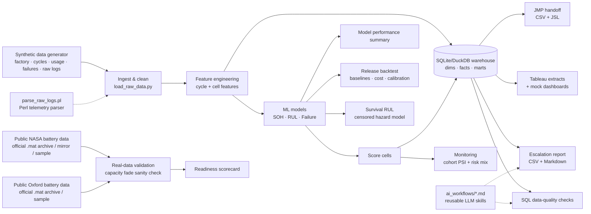

# Battery Failure Intelligence Platform

**A battery failure analytics platform for engineering investigation and early
warning.** It turns synthetic production-style cell, cycle, factory, usage, and
failure data into a SQL warehouse, leakage-aware ML models, model-release
backtests, and escalation reports that explain which cells, lots, stations, or
conditions deserve engineering review.

> **Data disclaimer:** the default end-to-end pipeline uses **synthetic,
> physically-motivated battery data** generated locally. The repo also includes
> bundled validation samples and adapters for **public real NASA PCoE and Oxford
> battery aging data**.
> It does **not** use confidential company data and does **not** imply access to
> any internal production system.
>
> This is a synthetic production-style analytics platform, not a validated production battery model.

---

## 30-second read

- **Question answered:** if 200 cells run and 20 fail, how do we compare pass/fail cells, control batch/test-condition bias, and turn model signals into engineering investigation?
- **Two failure-model modes:** retrospective investigation can use lifetime features such as `final_soh`; early warning only uses first-50-cycle features.
- **Validation discipline:** grouped splits, release backtest, baseline comparison, threshold cost review, calibration, drift checks, and explicit synthetic/real-data boundaries.
- **Real-data sanity checks:** NASA PCoE and Oxford public aging datasets validate degradation parsing, not production accuracy.

For a quick technical audit, start with the
[readiness scorecard](reports/project_readiness_scorecard.md), then skim the
generated reports under [Demo outputs](#demo-outputs).

**Run it in 3 commands:**
```bash
pip install -r requirements.txt      # 1. install (Python 3.10+)
bash scripts/run_daily_pipeline.sh   # 2. generate everything end-to-end
pytest -q                            # 3. run the test suite
```

Skip to [**Demo outputs**](#demo-outputs) to read the generated reports without running anything.

---

## Demo outputs

Prefer to skim the results first? These are real artifacts the pipeline generates,
committed so you can read them on GitHub without running anything:

- [**Daily escalation summary**](reports/high_risk_cells_summary.md) — ranked high-risk cells with likely root cause + recommended follow-up.
- [**Hiring manager review packet**](reports/hiring_manager_packet.md) — the fastest proof path: what to inspect first, evidence map, interview hooks, and honest boundaries.
- [**Panel interview guide**](docs/interview/PANEL_INTERVIEW_GUIDE.md) — concise Apple Battery DS panel talk track, JD mapping, and no-overclaiming answers.
- [**200-battery ad-hoc investigation**](reports/ad_hoc_200_battery_failure_investigation.md) — how to investigate 180 pass / 20 fail cells with SQL, bias controls, and engineering actions.
- [**Single-cell investigation case study**](reports/cell_investigation_case_study.md) — one escalated cell with peer context, root-cause signal, and engineering follow-up.
- [**Model performance summary**](reports/model_performance_summary.md) — SOH / RUL / retrospective failure / early-warning failure metrics.
- [**Early-warning failure model**](reports/early_warning_model_summary.md) — first-50-cycle model with explicit leakage boundary.
- [**Model release backtest**](reports/model_release_backtest.md) — later-cohort validation, baseline comparison, threshold cost, and calibration.
- [**Censored RUL survival model**](reports/survival_rul_summary.md) — discrete-time hazard model for cells that have not yet crossed EOL.
- [**Real NASA data validation**](reports/real_data_validation_summary.md) — degradation recovered from NASA's official `.mat` battery-aging archive.
- [**NASA full-archive local run note**](reports/nasa_full_archive_local_run_summary.md) — clarifies that full-archive counts are optional/local, not the committed default report.
- [**Real Oxford data validation**](reports/oxford_real_data_validation_summary.md) — second-source parser over Oxford pouch-cell cycling data.
- [**Real-data limitations**](reports/real_data_coverage_and_limitations.md) — what is real, what remains synthetic, and what production validation would require.
- [**Authorized production data contract**](docs/production_data_access/production_data_contract.md) — production-style schemas, access runbook, and validation plan without private data.
- [**Public dataset expansion plan**](docs/public_battery_dataset_expansion_plan.md) — CALCE, Oxford, and Severson/MIT-Stanford datasets assessed for future adapters.
- [**Tableau dashboard blueprint**](dashboards/tableau_dashboard_blueprint.md) — the 4 dashboard pages (fields + charts per page).
- [**Project readiness scorecard**](reports/project_readiness_scorecard.md) — evidence-based mapping of each engineering competency to a concrete artifact.

---

## Why this project exists

Battery reliability teams live and die by three questions, every single day:

1. **How healthy is each cell?** (state of health)
2. **How much life is left?** (remaining useful life)
3. **Which cells / lots / stations need to be escalated *now*?** (failure risk)

This platform answers all three on a reproducible, automated cadence — from raw
telemetry all the way to a ranked escalation queue with a likely root cause and a
recommended engineering follow-up for every flagged cell. It is deliberately built
as an **engineering analytics system**, not a one-off Kaggle notebook: it has a
landing zone, a star-schema warehouse, data-quality gates, modular pipeline steps,
tests, CI, and reusable AI workflows.

## Architecture



The whole thing is orchestrated by **`scripts/run_daily_pipeline.sh`** (17 steps),
runs locally from a fresh clone with no database server, and is exercised in CI on
every push.

---

## Data model

Five linked source tables drive the default synthetic warehouse:

| Table | Grain | Key fields |
| --- | --- | --- |
| **factory** | one row / cell | `cell_id, batch_id, lot_id, station_id, test_temperature, charge/discharge_current, manufacturing_date, test_date, equipment_id` |
| **cycles** | cell × cycle | `cycle_index, voltage_*, current_mean, temperature_mean/max, discharge/charge_capacity_ah, internal_resistance_mohm, energy_wh, timestamp` |
| **usage** | one row / cell | `avg_depth_of_discharge, fast_charge_ratio, avg_daily_cycles, high/low_temp_exposure_hours, usage_profile` |
| **failure_events** | one row / cell | `event_date, event_type, capacity_drop/impedance_spike/thermal_anomaly events, early_degradation_flag, escalation_required, failure_severity` |
| **model_predictions** | one row / cell | `prediction_date, predicted_soh, predicted_remaining_cycles, failure_probability, risk_tier, top_risk_driver` |

### Warehouse (star schema)

```
dim_cell · dim_lot · dim_station · dim_test_condition
fact_cycle_measurements · fact_usage_profile · fact_failure_events · fact_model_predictions
mart_cell_health_summary · mart_factory_quality · mart_escalation_queue
```

DDL: [`sql/create_schema.sql`](sql/create_schema.sql) · marts:
[`sql/build_marts.sql`](sql/build_marts.sql) · QC:
[`sql/quality_checks.sql`](sql/quality_checks.sql) · ad-hoc engineering questions:
[`sql/example_ad_hoc_queries.sql`](sql/example_ad_hoc_queries.sql).

### Real Public Data Validation

The default ML/warehouse training path remains **synthetic** so it is fast and
fully reproducible. As an independent **external validation** layer, the project
also ingests **real public NASA PCoE battery aging data** and writes
`reports/real_data_validation_summary.md` and
`reports/real_data_coverage_and_limitations.md` from
`data/processed/nasa_real_cycle_summary.csv`.

`src/ingest/import_public_battery_data.py` selects the best available source, in
order of authority:

1. **Official NASA `.mat` archive** — `src/ingest/nasa_mat_parser.py` parses
   NASA's original MATLAB `.mat` files **directly** (capacity → SOH, plus
   per-discharge temperature and voltage slopes derived from the raw signals).
   Place the archive at `data/raw/5. Battery Data Set/` (the nested
   `BatteryAgingARC_*.zip` files NASA ships) and it is used automatically:
   `SOURCE=archive bash scripts/run_real_data_validation.sh`
   To scan every battery discoverable in the local archive:
   `SOURCE=archive BATTERIES=all bash scripts/run_real_data_validation.sh`
   To parse a specific set:
   `SOURCE=archive BATTERY_IDS="B0005 B0006 B0049" bash scripts/run_real_data_validation.sh`
2. **Processed-CSV mirror** — a lightweight third-party convenience mirror for
   quick demos when the official archive is not on disk:
   `DOWNLOAD=1 bash scripts/run_real_data_validation.sh`
3. **Bundled sample** — a small committed sample (cells **B0005/B0006/B0007/B0018**,
   636 real discharge cycles) **generated from the official `.mat` archive**, so
   CI and fresh clones still produce a real-data report with no downloads.

Upstream source (≈200MB): `https://phm-datasets.s3.amazonaws.com/NASA/5.+Battery+Data+Set.zip`.
The official archive is gitignored (too large to commit); CI runs on the bundled
sample, while local runs that have the archive use the authoritative `.mat` files.

**Committed/default CI-friendly NASA report:** the repo commits the canonical
four-cell report below. This is the report a fresh clone or CI run can reproduce
without downloading the full archive.

| Battery | Discharge cycles | Capacity loss | First < 80% SOH | Corr(cycle, capacity) |
| --- | --- | --- | --- | --- |
| B0005 | 168 | 28.6% | 100 | −0.99 |
| B0006 | 168 | 41.7% | 60 | −0.98 |
| B0007 | 168 | 24.3% | 123 | −0.99 |
| B0018 | 132 | 27.7% | 74 | −0.97 |

**Optional local full-archive run:** if the official NASA archive exists locally,
the default four batteries can be overridden with `--battery-id` (for example,
`python -m src.ingest.import_public_battery_data --battery-id B0049`) or
`--all-available` / `BATTERIES=all` for full local archive coverage. A recorded
local full-archive run parsed **34 batteries / 2,750 discharge rows** and labeled
**13 batteries** as clear capacity-fade validation cases. Those counts refer to
the optional local archive run, not the committed/default report. The raw archive
should remain local and must not be committed to Git.

See [`reports/nasa_full_archive_local_run_summary.md`](reports/nasa_full_archive_local_run_summary.md)
for the optional full-archive boundary and
[`reports/real_data_coverage_and_limitations.md`](reports/real_data_coverage_and_limitations.md)
for the honest production-readiness boundary.

---

### Production Data Access: Authorized-Only Design

This repo does **not** contain proprietary production data, internal company data,
private credentials, restricted system exports, or raw factory records. The
production-data layer is a scaffold for an authorized environment only.

What is implemented:

- [`docs/production_data_access/gap_analysis.md`](docs/production_data_access/gap_analysis.md) — what the current repo proves and what it cannot prove without authorized production data.
- [`docs/production_data_access/production_data_contract.md`](docs/production_data_access/production_data_contract.md) — expected tables/streams such as factory tests, cycle measurements, usage telemetry, failure events, quality holds, dispositions, calibration logs, predictions, and escalation actions.
- [`docs/production_data_access/authorized_access_runbook.md`](docs/production_data_access/authorized_access_runbook.md) — least-privilege, read-only, approved access workflow.
- [`docs/production_data_access/production_validation_plan.md`](docs/production_data_access/production_validation_plan.md) — time-based, cell-grouped, lot/station holdout, leakage, label-quality, threshold, drift, and feedback-loop validation plan.
- [`src/ingest/production_connector.py`](src/ingest/production_connector.py) — a safe connector scaffold that can validate config or print the schema contract, but does not connect to private systems by default.
- [`data/mock_production/`](data/mock_production/) — tiny synthetic mock fixtures for connector tests only; not production data and not derived from confidential systems.

Useful commands:

```bash
python -m src.ingest.production_connector --schema-contract-only
BFI_PROD_DB_URI="mock+readonly://placeholder" \
BFI_PROD_DB_SCHEMA="battery_quality" \
BFI_PROD_READ_ONLY=true \
BFI_PROD_SAMPLE_LIMIT=10000 \
python -m src.ingest.production_connector --dry-run
```

In a real battery engineering team, this same pipeline shape would connect to
approved internal warehouse/API sources only after access approval, data-owner
review, least-privilege credential provisioning, schema validation, lineage
documentation, and retention-rule agreement. Production model validation would
require real factory, usage, failure-label, quality-hold, retest, and disposition
data calibrated with battery engineers.

---

## ML modeling overview

Models are trained with **leakage-aware, cell-grouped validation** (all cycles of a
given cell stay on one side of the split). Feature contracts are explicit in
[`src/models/_common.py`](src/models/_common.py).

| Model | Target | Algorithms | Headline metrics* |
| --- | --- | --- | --- |
| **State of Health** | `soh_current = discharge_cap / initial_cap` | Linear baseline vs RandomForest / GradientBoosting | **R² 0.948 · MAE 0.011 · RMSE 0.016** |
| **Remaining Useful Life** | cycles until SOH < 80% | RandomForest vs GradientBoosting | **MAE 46 cycles · RMSE 70 · R² 0.926** |
| **Censored RUL Survival** | time-to-80% SOH with right-censoring | Discrete-time logistic hazard model | See `reports/survival_rul_summary.md` |
| **Retrospective Failure Investigation** | `escalation_required` using lifetime features | Logistic baseline vs RandomForest | Used for pass/fail comparison and likely driver analysis |
| **Early-Warning Failure Risk** | eventual `escalation_required` using first 50 cycles only | Logistic baseline vs RandomForest | Used for early triage before lifetime outcome is known |

*From the latest 120-cell synthetic run; regenerated into
[`reports/model_performance_summary.md`](reports/model_performance_summary.md) every
pipeline run. Numbers vary slightly with data scale / quick mode.*

> **Reading the synthetic-data metrics honestly:** the failure-risk classifier's
> very high ROC-AUC is *expected* — the synthetic labels are generated from known
> degradation mechanisms, so a correct pipeline should recover them. These scores
> validate that the **feature logic and the training/scoring path work end to end**;
> they are **not** a claim of real-world production accuracy. The NASA/Oxford
> real-data layer is an independent **degradation sanity check**, and genuine production
> validation would require larger real factory / usage / failure datasets.

The failure models are deliberately split:

- **Retrospective investigation model:** can use lifetime features such as `final_soh`, lifetime fade rate, peak temperature, and full cycle count. Use it after enough data exists to compare failed vs passed cells and investigate likely causes.
- **Early-warning model:** uses only first-50-cycle measurements plus factory/test condition context. It excludes `final_soh`, lifetime peak temperature, full-life cycle count, and post-outcome fields.

The release backtest in [`reports/model_release_backtest.md`](reports/model_release_backtest.md)
adds a stricter gate: train on older manufacturing cohorts, evaluate on later
cells, compare against simple engineering baselines, review threshold cost, and
inspect probability calibration.

**Engineered features** include `capacity_fade_rate`, `resistance_growth_rate`,
`rolling_capacity_mean_10`, `rolling_temperature_max_10`, `rolling_resistance_mean_10`,
`soh_delta_last_20_cycles`, `cycle_count`, `fast_charge_ratio`,
`high_temp_exposure_hours`, `batch_failure_rate`, `station_anomaly_rate`.

**Explainability:** uses **SHAP** if installed, otherwise falls back to
**permutation importance**; the leading degradation drivers feed the
`top_risk_driver` column of every escalation row.

---

## Reporting automation

`scripts/run_daily_pipeline.sh` runs the full job end-to-end:

1. Generate / ingest data → 2. Parse raw logs (Perl) + validate files →
3. Build features → 4. Build warehouse → 5. Train / reuse models →
6. Score cells + write predictions to warehouse → 7. SQL quality checks →
8. Escalation report → 9. Tableau extracts → 10. JMP files →
11. Model monitoring → 12. Model performance summary →
13. Model-release backtest + early-warning + survival RUL validation →
14. NASA/Oxford real-data validation →
15. Hiring-manager packet + cell investigation → 16. Readiness scorecard →
17. File validation.

Outputs are written to `data/processed/`, `reports/`, and `dashboards/`.

---

## Tableau dashboard overview

Tableau Desktop is **not required**. The pipeline exports flat, BI-ready CSV
extracts to `dashboards/tableau_extracts/` and renders static PNG mockups to
`dashboards/screenshots_or_mockups/`. The full design (charts + fields per page)
is in [`dashboards/tableau_dashboard_blueprint.md`](dashboards/tableau_dashboard_blueprint.md):

1. **Executive Battery Health Overview** — fleet risk tiers, SOH vs remaining cycles.
2. **Factory Lot Quality** — escalation/anomaly rates by lot × station.
3. **Engineering Root Cause Analysis** — drivers by usage profile.
4. **Escalation Queue** — ranked cells needing action today.

---

## AI workflow overview

Four reusable, LLM-powered workflows for engineering analytics work live in
[`ai_workflows/`](ai_workflows/):

- **`anomaly_investigation_skill.md`** — triage a single `cell_id`: compare to batch
  peers, classify the failure signature, recommend the next engineering step.
- **`sql_report_generation_skill.md`** — turn a plain-English engineering question
  into safe, schema-aware SQL against the warehouse.
- **`model_debugging_workflow.md`** — structured checklist for leakage, weak recall,
  broken features, and drift.
- **`escalation_report_assistant.md`** — convert model outputs into a concise,
  decision-ready escalation summary.

---

## How to run locally

```bash
# 1. Install (Python 3.10+)
pip install -r requirements.txt

# 2. Run the full daily pipeline (generates everything from scratch)
bash scripts/run_daily_pipeline.sh

# 3. Run the tests
pytest
```

Useful variants:

```bash
RETRAIN=1 bash scripts/run_daily_pipeline.sh   # force model retraining
BFI_QUICK=1 bash scripts/run_daily_pipeline.sh # fast smoke test (small dataset)
bash scripts/sql_export.sh                     # export ad-hoc SQL results to CSV
perl scripts/parse_raw_logs.pl                 # parse raw telemetry logs only
BFI_DATA_SOURCES="cycler-db.local:5432" bash scripts/check_data_source_connectivity.sh
SOURCE=archive bash scripts/run_real_data_validation.sh # parse official NASA .mat archive
BATTERIES=all SOURCE=archive bash scripts/run_real_data_validation.sh
BATTERY_IDS="B0005 B0006 B0049" SOURCE=archive bash scripts/run_real_data_validation.sh
DOWNLOAD=1 bash scripts/run_real_data_validation.sh     # or fetch processed-CSV mirror
python -m src.ingest.import_oxford_battery_data         # Oxford sample/full archive validation
```

Explore interactively via the notebooks in [`notebooks/`](notebooks/) (requires
`jupyter`): EDA → feature engineering → model training → explainability.

---

## Example outputs

### Sample escalation report (`reports/escalation_report_sample.csv`)

| cell_id | lot_id | station_id | failure_prob | pred_soh | rem_cycles | likely_root_cause | recommended_follow_up |
| --- | --- | --- | --- | --- | --- | --- | --- |
| CELL-00032 | LOT-009 | ST-08 | 1.00 | 0.659 | 0 | Accelerated capacity fade (below 80% SOH) | Pull cell for teardown; check anode lithium plating |
| CELL-00069 | LOT-001 | ST-06 | 1.00 | 0.626 | 0 | Accelerated capacity fade (below 80% SOH) | Pull cell for teardown; check anode lithium plating |
| CELL-00074 | LOT-009 | ST-05 | 1.00 | 0.769 | 0 | Accelerated capacity fade (below 80% SOH) | Pull cell for teardown; check anode lithium plating |

A readable daily standup version is written to
[`reports/high_risk_cells_summary.md`](reports/high_risk_cells_summary.md).

### Model performance table

| Model | Metric | Value |
| --- | --- | --- |
| SOH | MAE / RMSE / R² | 0.0107 / 0.0160 / 0.948 |
| RUL | MAE / RMSE / R² | 46.1 / 70.1 / 0.926 |
| Failure | Precision / Recall / F1 / AUC | 0.750 / 1.000 / 0.857 / 0.993 |

---

## What you get after a run

- Processed synthetic battery data (`data/processed/*.csv`)
- Optional real public NASA battery validation report (`reports/real_data_validation_summary.md`)
- Optional real public Oxford battery validation report (`reports/oxford_real_data_validation_summary.md`)
- Hiring-manager review packet, panel guide, 200-battery ad-hoc report, and single-cell case study (`reports/hiring_manager_packet.md`, `docs/interview/PANEL_INTERVIEW_GUIDE.md`, `reports/ad_hoc_200_battery_failure_investigation.md`, `reports/cell_investigation_case_study.md`)
- Local SQL warehouse (`data/processed/battery_warehouse.db`)
- Trained model artifacts (`data/processed/models/*.joblib`)
- Escalation report CSV + high-risk markdown summary (`reports/`)
- Tableau-ready extracts + mock dashboards (`dashboards/`)
- JMP-ready CSV + JSL starter analysis (`reports/jmp_*`)
- Model monitoring / cohort drift summary (`reports/model_monitoring_*`)
- Model performance summary (`reports/model_performance_summary.md`)
- Early-warning failure model summary (`reports/early_warning_model_summary.md`)
- Model release backtest and calibration (`reports/model_release_backtest*`, `reports/model_release_calibration.csv`)
- Censored RUL survival summary (`reports/survival_rul_summary.md`)
- Evidence-based readiness scorecard (`reports/project_readiness_scorecard.md`)
- Passing test suite + green CI

---

## Skills demonstrated

`Python` · `pandas/numpy` · `scikit-learn` · `feature engineering` ·
`SQL data warehousing & dimensional modeling` · `SQLite/DuckDB` ·
`data-quality testing` · `time-series degradation modeling` ·
`classification & regression` · `survival / censored RUL modeling` ·
`release backtesting & calibration` · `model explainability (SHAP / permutation)` ·
`reporting automation` · `Tableau dashboard design` · `JMP handoff files` ·
`TCP/IP data-source preflight` · `Unix / Bash / Perl` ·
`pytest` · `GitHub Actions CI` · `reusable AI/LLM workflows` ·
`battery-reliability domain storytelling`.

---

## Assumptions made

- **Synthetic data** stands in for proprietary cycler/factory data; the generator
  uses a physically-motivated capacity-fade + impedance-growth model with a knee,
  modulated by usage profile, lot quality, and test-station calibration.
- **EOL = 80% SOH** (industry-standard convention).
- **SQLite** is the default warehouse engine for zero-friction local runs; the code
  is written so **DuckDB** can be swapped in.
- **Escalation** = model High/Critical risk **or** an existing failure-event flag.
- Optional libraries (SHAP, LightGBM/XGBoost) are **auto-detected**; the pipeline
  runs fully without them.

---

## Future improvements

- True high-frequency raw telemetry → cycle-aggregation pipeline (not just summary rows).
- Online / incremental scoring + model-drift monitoring against a baseline snapshot.
- Survival analysis (Cox / Weibull) for RUL with censoring instead of point regression.
- dbt models over the warehouse + Great Expectations for declarative data quality.
- Real public datasets (e.g. NASA PCoE, MIT-Stanford Severson) behind the same interface.
- A served API / scheduled job (Airflow) and a live Tableau Server data source.

---

*License: MIT. Default factory/usage/failure data is synthetic; NASA validation data is public; mock production fixtures are synthetic. Not affiliated with or endorsed by any battery manufacturer.*
